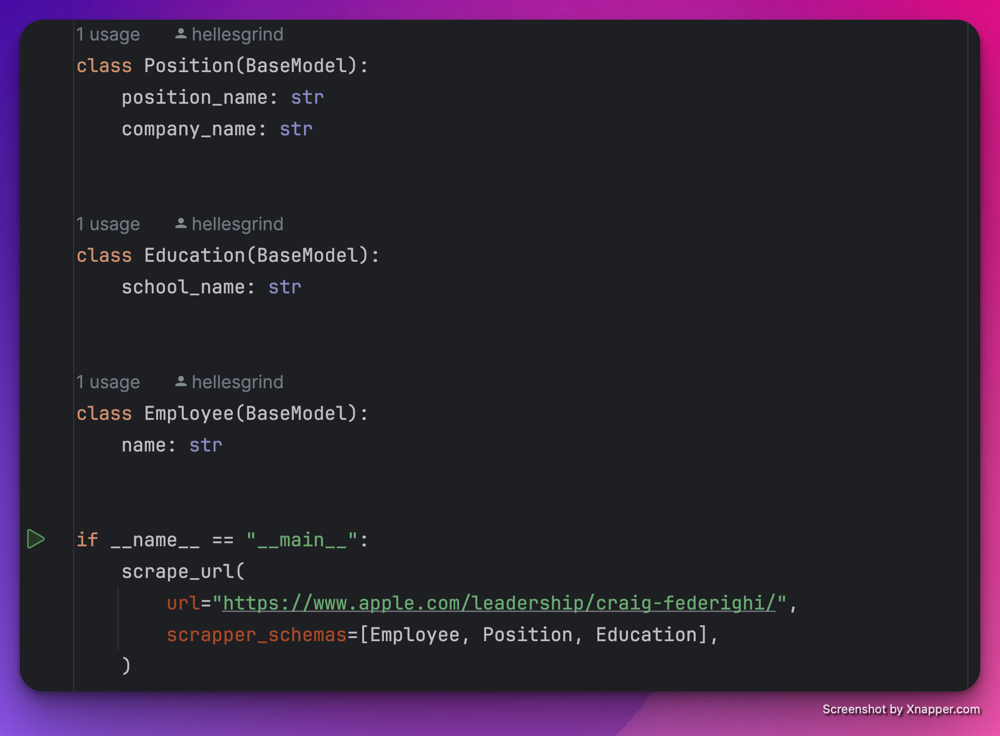
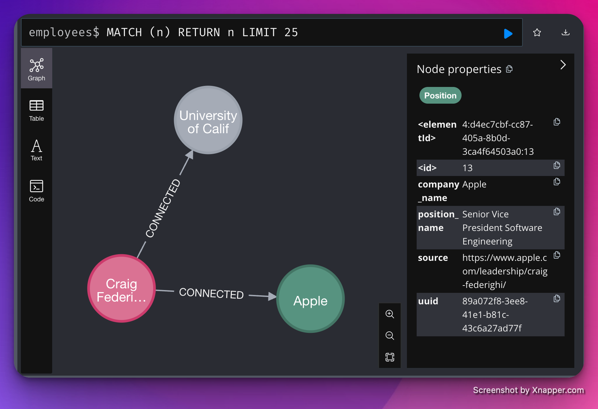

# LLMScrapper
**NOTE:** This is a reeeealy early version, there's a lot of to-be-done here.
Proof-of-concept of Web-scrapper based on Knowledge Graphs and powered by OpenAI API.




## Getting Started 🌟
### Prerequisites
Before you begin, ensure you have the following installed:
- Python 3.6 or higher
- Docker
- `pip install pydantic==2.7.0` and `pip install requests==2.31.0` to run client (`main.py`)

### Installation

1. Clone the repository:
   ```sh
   git clone https://github.com/hellesgrind/llm-scrapper.git
   ```

2. Navigate to the project directory:
   ```sh
   cd llm-scrapper
   ```

3. Add OPENAI_API_KEY to `.env` and build Docker Containers.
    ```sh
    OPENAI_API_KEY=<API key goes here>
    ```


4. Build and run Docker container with app
   ```sh
   docker compose -f docker-compose.yml up -d --build 
   ```
   
## Usage 🎉

### Run LLMScrapper
1. Go to `main.py`
2. Identify schema of info that you want to extract using Pydantic models
3. Pass the URL of Website.
4. In terminal: `python main.py` 

### Neo4J
You can see the visualized graph via Neo4j Frontend.

1. Go to `http://localhost:7474`
2. Credentials: Username `neo4j`, Password `pleaseletmein`, Database host `http://localhost:7687`
3. Navigate to `Use database` and select `neo4j`


## Project Structure

LLMScrapper is organized into several key components:

- `main.py`: A client to initialize schemas of info to extract and URL of website.
- `app/main.py`: FastAPI app with endpoint that receives schemas and URL.
- `app/parser.py`: Parses the text and all sub-links of website.
- `app/scrapper.py`: LLM-agent that extracts info from text of website using OpenAI API. (`TBD:` Using LLM, identify sub-pages that may contain useful info and scrape them too)
- `app/data_manager.py`: Manages the extracted info and inserts it to database. (`TBD:` Should become an LLM-agent that dynamically updates records in database with new extracted info)
- `app/database.py`: Client interface for managing database.
